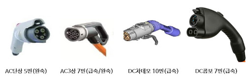

<ui style="position:fixed;left: 3em; top:10em; font-size: 0.8em;">
    <li><a href = "#charge_type"><bold>1. 충전 속도에 따른 분류</bold></a></li>
    <li><a href = "#charge_setting"><bold>2. 충전기 설치 방식에 따른 분류</bold></a></li>
    <li><a href = "#charge_connector"><bold>3. 충전 커넥터에 따른 분류</bold></a></li>
    <li><a href = "#charge_owner"><bold>4. 충전기 소유자에 따른 분류</bold></a></li>

</ui>

# 충전기

## 1. 충전 속도에 따른 분류
전기 자동차 충전 방식은 충전 속도에 따라 완속 충전과 급속 충전으로 분류할 수 있다.
전기 자동차의 배터리는 직류이기 때문에 교슈 전류를 사용하는 완속 충전을 하게 될 경우 차량 내에서 OBC가 교류에서 직류로 변화 해주는 시간이 별로도 필요하다.

### (1) 완속 충전기

- 사용 전류 : 교류(AC)
- 충전 시간 : 4~5시간
- 전력 용량 : 6~7kW
- 충전 요금 : 약 100km당 1,100원
- 충전기 설치 장소 : 가정(주택 및 아파트)
- 단점 : 별로의 전류 변환이 없는 급속 충전에 비해 시간이 오래 걸림

 

### (2) 급속 충전기
- 사용 전류 : 직류(DC)
- 충전 시간 : 15 ~ 30분 (0 ~ 80% 충전)
- 전력 용량 : 50kW
- 충전 요금 : 약 100km당 2,700원
- 충전기 설치 장소 : 공공 장소(휴게소, 공공 기관 등)
- 단점 : 제조사별로 충전 커넥터 방식이 다름

 
 

## 2. 충전기 설치 방식에 따른 분류
전기 자동차의 충전기는 설치 방식에 따라 벽부형(테이블형), 스탠드형, 휴대용 충전기로 분류할 수 있다

 

### (1) 벽부형(테이블형) 충전기

- 유형 : 고정형
- 충전 시간 : 4~6시간
- 전력 용량 : 3~7kW
- 특징
    - 분전함, 기초 패드 설치
    - U형 볼라드, 차량 스토퍼, 차선 도색 (설치 및 미설치)
    - 충전기 위치가 외부에 설치되어 눈, 비에 노출될 경우만 케노피 설치

 

### (2) 스탠드형 충전기

- 유형 : 고정형
- 충전 시간 : 4~6시간
- 전력 용량 : 3~7kW
- 특징
    - 분전함, 기초 패드 설치
    - U형 볼라드, 차량 스토퍼, 차선 도색 (설치 및 미설치)
    - 충전기 위치가 외부에 설치되어 눈, 비에 노출될 경우만 케노피 설치

 

### (3) 휴대용 충전기

- 유형 : 이동형
- 충전 시간 : 6 ~ 9시간 또는 14 ~ 20시간
- 전력 용량 : 3Kw(최대)
- 요금 : 과금형
- 설치 장소 : 파워 큐브 신청한 콘센트
- 특징
    - 220V 콘센트에 간단한 식별장치(RFID 태그) 부착하여 충전
    - 태그가 부착된 다른 건물에서도 충전 가능
    

 
 

## 3. 충전 커넥터에 따른 분류

국내에서 사용하는 충전 방식에 따른 충전기 커넥터는 표준은 크게 4가지로 **AC 단상 5핀, AC3상 7핀, DC 차데모, DC 콤보 7핀**이다. 

{: .mx-auto.d-block :}

 

### (1) AC 단상 5핀
- 충전 유형 : 완속
- 급속/ 완속 충전구 구분 : 분리형
- 충전 속도 : 7kW
- 이용 국가 : 한국, 미국, 일본
- 이용 차종 : 현대기아차(아이오닉, 쏘울, 블루온, 레이, 코나, 니로), 한국GM(스파크, 볼트), BMW(i3), 닛산(Leaf), 테슬라(어답터 필요)

{: .box-note}
완속 충전에 많이 사용되며, 한국, 미국, 일본의 공통 표준이다.

 

## (2) AC3상 7핀
- 충전 유형 : 완속, 급속
- 급속/완속 충전구 구분 : 일체형
- 이용 국가 : 유럽 한국
- 이용 차종 : 르노 삼성(SM3 ZE)

{: .box-note}
전력망을 효율적 관리 가능하다.

 

### (3) DC 차데모

- 충전 유형 : 급속
- 급속/ 완속 충전구 구분 : 분리형
- 충전 속도 : 30~40kW
- 이용 국가 : 일본, 한국
- 이용 차종 : 현대기아차(아이오닉, 쏘울, 블루온, 레이), 닛산(Leaf), 테슬라

{: .box-note}
전파 간섭 작다.

 

### (4) DC 콤보 7핀

- 충전 유형 : 급속
- 급속/ 완속 충전구 구분 : 일체형
- 충전 속도 : 100kW
- 이용 국가 : 미국, 유럽, 한국
- 이용 차종 : 현대기아차(아이오닉, 쏘울, 코나, 니로), 한국GM(스파크, 볼트), BMW(i3)

{: .box-note}
급속 충전 방식으로는 미국, 유럽에서 많이 사용된다. 급속 충전 속도 빠르고, 급속과 완속 충전구가 일체형으로 직류와 교류 모듈을 동시에 사용할 수 있다. 그리고 공간 활용도 높다.

 

### (5) 데스티네이션 차저(Destination Charger)
``* 테슬라 전용``

- 충전 유형 : 완속
- 충전 속도 : 7~16kW
- 이용 차종 : 테슬라, SM3 ZE

{: .box-note}
테슬라 자체 충전기(완속)에 활용된다. 

 

### (6) 슈퍼 차저(Super Charger)
``* 테슬라 전용``

- 충전 유형 : 급속
- 충전 속도 : 125kW(V2), 250kW(V3)
- 이용 차종 : 테슬라

{: .box-note}
테슬라 자체 충전기(급속)에 활용된다.

 
 

## 4. 충전기 소유자에 따른 분류

 

### (1) 공용 충전기
- 대형 마트, 휴게소, 관공서, 공영주차장 등에 설치된 공용 충전기는 누구나 이용이 가능한 충전기
- 스마트폰 APP(EV where) 혹은 환경부 홈페이지를 통해 위치 및 상태 확인도 가능하다.
- 설치 장소에 따라 완전 개바오가 부분 개방으로 구분된다.
    - 완전 개방 : 공용 주차장, 휴게소 등 충전을 위해 차량 출입이 자유로운 곳에 설치되는 공용 충전기
    - 부분 개방 : 아파트 등 해당 지역에 거주하는 다수를 위해 설치되는 공용 충전기

 

### (2) 비공용(개인용) 충전기
- 충전기 소유자만 사용할 수 있으며, 개인이 충전기 설치 부대비용을 모두 부담해야 한다. 
- 충전이 편리하고, 공용 충전기를 사용할 때보다 저렴하게 이용할 수 있다. 
- 보조금 지원 : 전기 차량 구매 1년 내의 설치 부지를 확보한 차주에게 보조금을 지원하며, 충전기 설치 유형에 따라 지급 금액이 다르다.
    - 벽부형 및 스탠드형 충전기 설치 시 150만원
    - 휴대용 충전기 설치 시 90만원
    - 단, 보조금은 충전기 구매 및 설치 비용 범위 내에 지원하며 그외 비용이 초과되는 경우 차주가 부담해야 한다.
    - 보조금 지원 신청은 (환경부 저공해차 통합 누리집)[https://www.ev.or.kr/portal/schargerAll?pMENUMST_ID=21676] 내 완속 충전기 설치 신청 페이지를 확인하여 진행할 수 있다.
