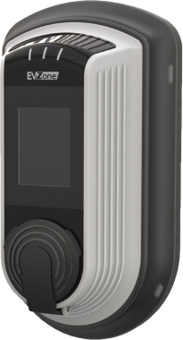
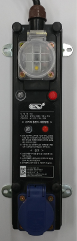

<ui style="position:fixed;left: 3em; top:10em; font-size: 0.8em;">
    <li><a href = "#support_who"><bold>1. 보조금 지원 대상</bold></a></li>
    <li><a href = "#support_car"><bold>2. 보조금 지원 차량</bold></a></li>
    <li><a href = "#support_howto"><bold>3. 보조금 신청 절차</bold></a></li>
    <li><a href = "#support_news"><bold>4. 보조금 현황</bold></a></li>
</ui>

# 구매 지원 

## 1. 보조금 지원

보조금 지원 안내는 환경부가 운영하는 [저공해차 통합누리집](https://www.ev.or.kr/portal/buyersGuide/incenTive?pMENUMST_ID=21549)에서 상세 확인할 수 있다.

### 1.1. 보조금 지원 대상
중앙행정기관을 제외한 개인, 법인, 공공기관, 지방자치단체, 지방공기업 등  
등국고보조금 외 지방보조금을 추가로 지원하는 지방자치단체는 관할 자치단체 내 거주 등 자격조건 부여 가능하다.

 

### 1.2. 보조금 지원 차량
아래의 사항을 충족하는 전기자동차
- 「자동차관리법」, 「대기환경보전법」, 「소음·진동관리법」 등 관계법령에 따라 자동차와 관련된 각종 인증을 모두 완료한 차량
- 「전기자동차 보급대상 평가에 관한 규정」에 따른 전기차의 평가항목 및 기준에 적합한 차량

 

### 1.3. 보조금 신청 절차
*2020년 기준

구매자는 차량구매대금과 보조금의 차액을 자동차 제조‧수입사에 납부하고, 자동차 제조‧수입사는 지방자치단체(국비보조금+지방비보조금)로부터 보조금을 수령한다.

 

### 1.4. 보조금 현황

#### (1) 승용 및 초소형 전기자동차의 국고 보조금

| 구분 | 제조/수입사 | 차종 | 국고보조금 지원금액(만원) | 
| :------: | :------: | :------: | :------: |
| 승용 | 현대자동차 | 아이오닉 전기차(HP) | 820 | 
| 승용 | 현대자동차 | 아이오닉 전기차(PTC) | 814 | 
| 승용 | 현대자동차 | 코나(기본형, PTC) | 820 | 
| 승용 | 현대자동차 | 코나(경제형) | 766 | 
| 승용 | 현대자동차 | 코나(기본형, HP) | 820 | 
| 승용 | 기아자동차 | 니로EV(HP) | 820 | 
| 승용 | 기아자동차 | 니로EV(PTC) | 820 | 
| 승용 | 기아자동차 | 니로EV(경제형) | 741 | 
| 승용 | 기아자동차 | 전기차(기본형) | 820 | 
| 승용 | 기아자동차 | 전기차(도심형) | 744 | 
| 승용 | 르노삼성 | SM3 Z.E | 616 | 
| 승용 | 르노삼성 | ZOE | 736 | 
| 승용 | 비엠더블유코리아 | i3 94Ah | 679 | 
| 승용 | 비엠더블유코리아 | i3 120Ah | 716 | 
| 승용 | 한국지엠 | BOLT EV(65.94kWh) | 820 | 
| 승용 | 한국닛산 | LEAF | 686 | 
| 승용 | 테슬라 | Model S 100D | 748 | 
| 승용 | 테슬라 | Model S P100D | 734 | 
| 승용 | 테슬라 | Model S Performance | 769 | 
| 승용 | 테슬라 | Model S Long Range | 771 | 
| 승용 | 테슬라 | Model S Standard Range | 736 | 
| 승용 | 테슬라 | Model 3 Performance | 760 | 
| 승용 | 테슬라 | Model 3 Standard Range Plus RWD | 793 | 
| 승용 | 테슬라 | Model 3 Long Range | 800 | 
| 승용 | 재규어랜드로버코리아 | 재규어 I-PACE | 625 | 
| 승용 | 벤츠 | EQC 400 4MATIC | 630 | 
| 승용 | 한불모터스 | Peugeot e-208 | 653 | 
| 승용 | 한불모터스 | DS3 Crossback E-tense | 628 | 
| 승용 | 한불모터스 | Peugeot e-2008 SUV | 628 | 
| 승용 | 아우디폭스바겐코리아 | e-tron 55 quattro | 628 | 
| 승용 | 쎄미시스코 | SMART EV Z | 689 | 
| 초소형 | 르노삼성 | TWIZY(K1J05)| 400 | 
| 초소형 | 대창모터스 | Danigo)| 400 | 
| 초소형 | 르노삼성 | TWIZY(K1J05)| 400 | 
| 초소형 | 캠시스 | CEVO-C | 400 | 
| 초소형 | 캠시스 | CEVO-C SE | 400 | 
| 초소형 | 케이에스티일렉트릭 | 마이브 M1 | 400 | 

 

#### (2) 2020년 지자체별 전기차, 수소차 보조금
	
| 시도 | 전기자동차 | 수소자동차 |  
| :------: |:------: | :------: |
| 서울특별시 | 450 | 1,250 |  
| 부산광역시 | 500	| 1,200 |  
| 대구광역시 | 500 | 1,250 |  
| 인천광역시 | 580 | 1,000 |  
| 광주광역시 | 580 | (미정) |  
| 대전광역시 | 700 | 1,200 |  
| 울산광역시 | 600 | 1,150 |  
| 세종특별자치시 | 400 | 1,000 |  
| 경기도 | 500 ~ 600 | 1,000 ~ 1,750 |  
| 강원도 | 600 ~ 900 | 2,000 |  
| 충청북도 | 800 | 1,000 |  
| 충청남도 | 700 ~ 800 | (미정) |  
| 전라북도 | 900 | 1,400 |  
| 전라남도 | 600 ~ 800 | 1,000~1,500 |  
| 경상북도 | 600 ~ 1,000 | - |  
| 경상남도 | 600 ~ 800 | 1,060 |  
| 제주특별자치도 | 500 | - |  

## 2. 완속충전기 설치

### 2.1. 완전개방 충전기

#### (1) 00

### 2.2. 부분개방 충전기

#### (1) 00

### 2.3. 충전 보조 시설

|       제조사       |     타입     | 제품 사진 (모델명) | 제품 설명                                                    |
| :----------------: | :----------: | :-------------------: | :----------------------------------------------------------- |
|   (주) 매니지온    | 무선인식표지 |  이볼트 무선인식표지 | 기타 - 과금형 이동형 충전기 사용 시 필요 \- 그린, 오렌지, 옐로우, 브라운, 민트, 퍼플 여섯 가지 컬러 \- 컬러로 차단기(ZONE) 구분 |
|   (주) 매니지온    |  전용콘센트  |  MeCON(미콘) | 기타 - 무선인식표지(전자태그) 내장 \- 국내 모든 이동형 충전기(과금형) 사용 가능 \- 승인되지 않은 전기제품 사용 불가 \- 블루투스 통신으로 전원 제어(관리자 기능제공) |
|    (주)스타코프    | 과금형콘센트 |  STARCC V1.1 | 충전요금 : 173.8원 (부가세포함)  결제방법 : 신용카드, 회원카드, 앱  정격용량 : 3.5kW 제품크기 : 110(W) x 190(H) x 100(D) mm  충전케이블 : 일반 220V 충전 케이블 기타 \- 과학기술부 및 국가기술표준원 기술혁신 지정 제품 \- 계량성능 유효1.0급 \- AI기반 전기차 인식기술 \- 24시간 전기안전 관리 \- RFID/NFC 인증 기능 \- 관련 특허 등록 4건, 출원 8건 |
|     (주)차지인     | 과금형콘센트 |  CZi-mg-WS00F | 충전요금   - 아파트 272원 (회원) - 공공기관 272원 (회원) - 기타상업시설 272원 (회원) *부가세포함 결제방법 : EVZ APP에 신용카드, T머니 등록 후 사용  정격용량 : 3 kW 제품크기 : 133(W) X 233(H) X 91(D) mm  기타 - LCD Display 및 LED 상태표시 - 건물 내 220V 표준규격 콘센트에 설치 - 스마트폰 EVZ앱을 통한 과금 기능, 충전기 상태 확인 및 연동, 충전 예약 기능 - 국내 외 전기차 및 e-모빌리티 충전 가능 |
| (주)파워큐브코리아 |  전용콘센트  |  JGC-R101 | 충전요금 : 월사용량 후불결제 *부가세포함 결제방법 : 회원후불결제  정격용량 : 3 kW 제품크기 : 80 X 120 X 500 (mm) 충전케이블 : 이동형충전기 전용  기타 \- 과금형 휴대형충전기 사용충전 \- 기기인증(RFID) \- 태그로 건물 및 사용자 인증 |
| (주)파워큐브코리아 |  전용콘센트  |  SSC | 충전요금 : 월사용량 후불결제 *부가세포함 결제방법 : 회원후불결제  정격용량 : 3 kW 제품 크기 : 290 X 73 X 60  충전케이블 : 콘센트형 - 과금형 휴대용충전기 사용 기타 \- 과금형 휴대형충전기 사용충전 \- 태그로 건물 및 사용자 인증 |
|    대영채비(주)    | 과금형콘센트 |  STARCC V1.1 | 충전요금 : 173.8원 *부가세포함 결제방법 : QR코드, 회원카드 결제  정격용량 : 3.5 kW 제품 크기 : 190 X 110 X 40  충전케이블 : 케이블 분리형(220V)  |

## 3. 기타 인센티브

### 3.1. 정부지원 인센티브

#### (1) 전기차 세제혜택

|  조세  |    구분    |        과세 부과율        | 감면한도 |
| :----: | :--------: | :-----------------------: | -------- |
|  국세  | 개별소비세 |      * 차량가액의 5%       | 300만원  |
|  국세  |   교육세   |  개별소비세의 30%90만원   | 90만원   |
| 지방세 |   취득세   | ** 차량가격의 7% (경차,4%) | 140만원  |

*차량가액 : 공장도가격

**차량가격 : 공장도가격 + 개별소비세 + 교육세

#### (2) 전기차 세제혜택

- 지방세법 제127조(과세표준과 세율)에 따라 전기차는 그 밖의 승용자동차로 분류되며, 영업용은 20,000원, 비영업용은 지방교육세(30%)가 포함되어 130,000원이 부과됩니다.

|   구분   |  영업용  | 비영업용  |
| :------: | :------: | :-------: |
| 자동차세 | 20,000원 | 130,000원 |

### 3.2 충전요금 할인 및 기타혜택

#### (1) 서울시 공영주차장 감면 혜택 (일부공영주차장 제외)

- 관련근거 : 서울특별시 주차장 설치 및 관리조례 제7조 제1항 제10호
- 시행일자 : 2016년 10월 15일
- 내용 : 시장이 설치한 공영주차장(노상 및 노외)에서 전기차를 충전할 경우 1시간 범위 내에서 주차요금을 면제하고 1시간      초과시부터 부과되는 주차요금의 100분의 50을 할인

