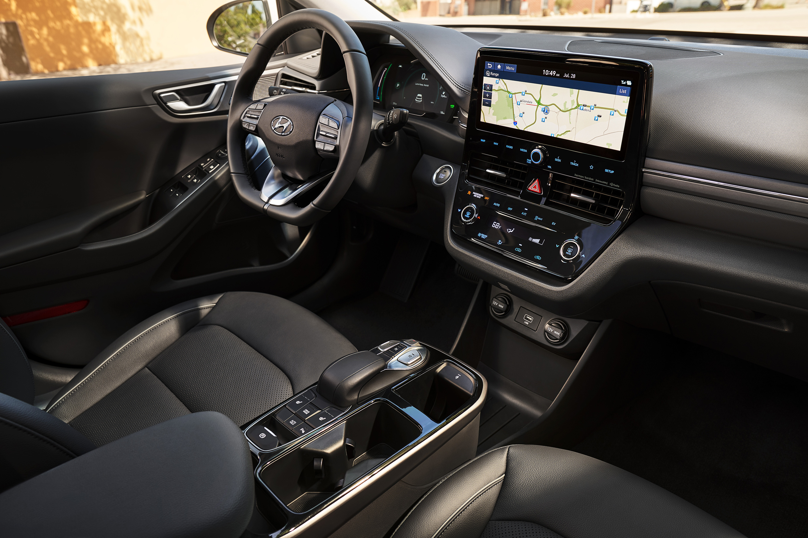
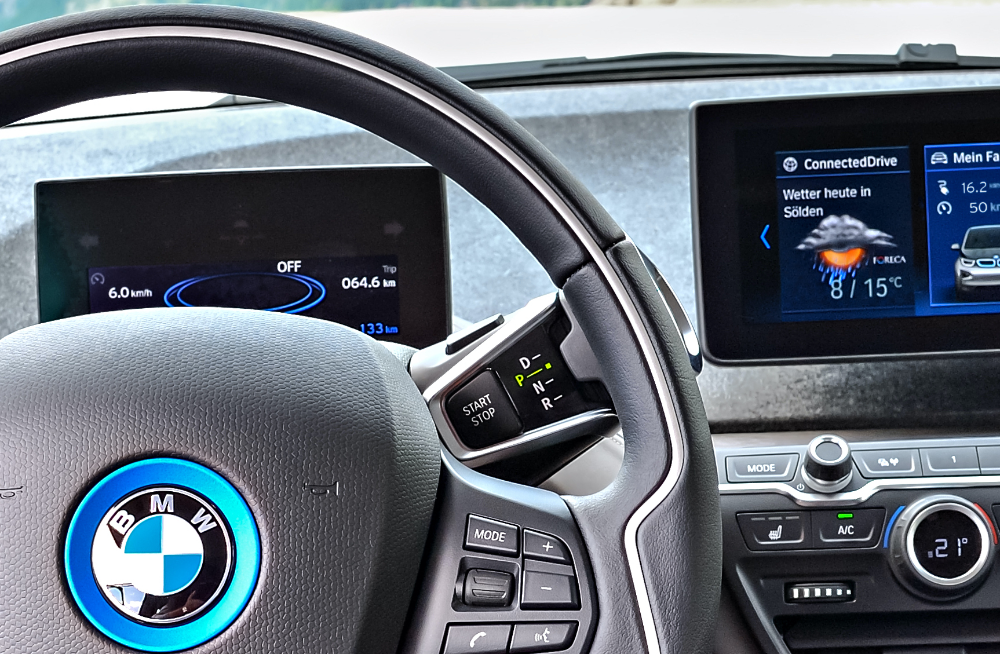
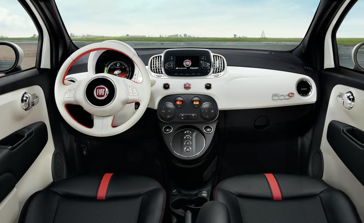
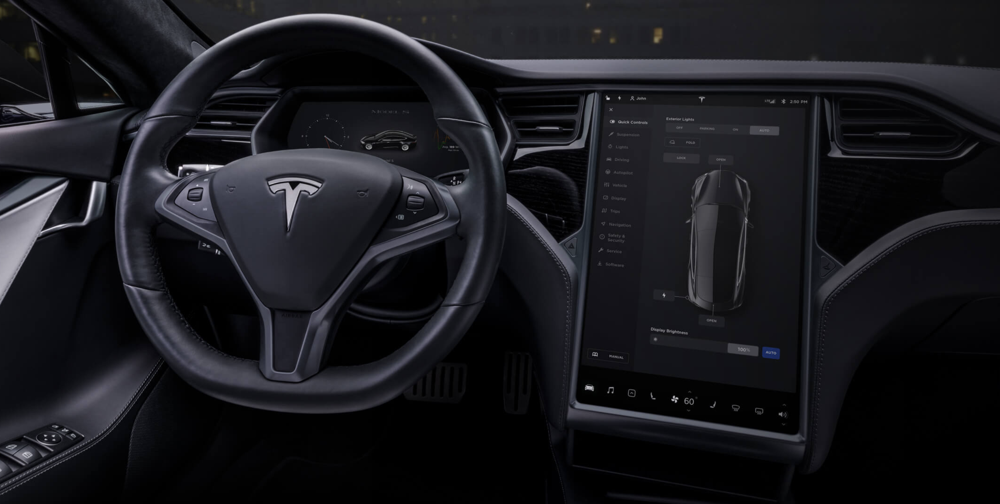
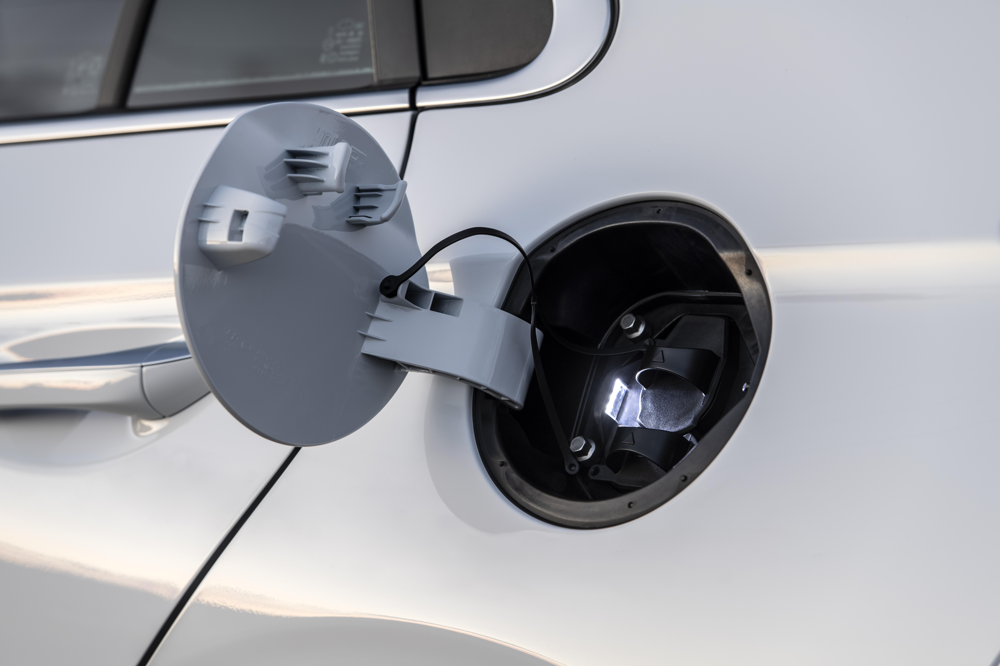
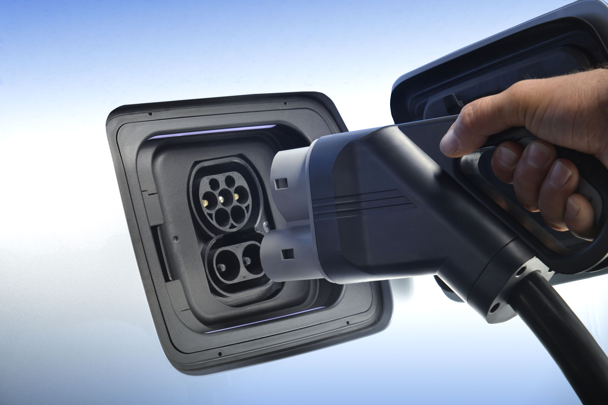
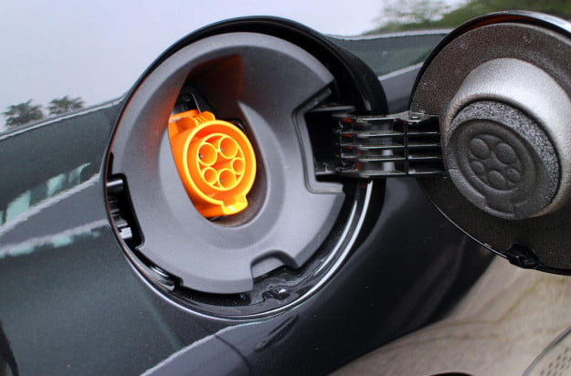
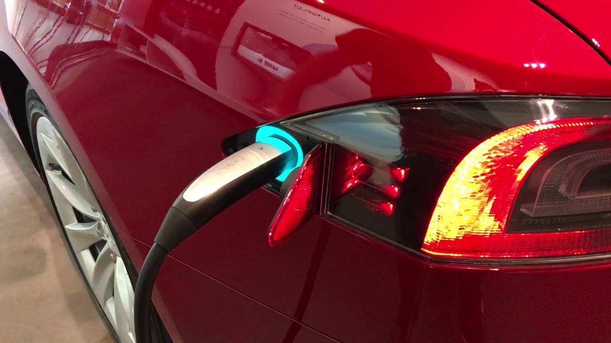

<ui class="subnavi" style="position:fixed;left: 3em; top:10em; font-size: 0.8em;">
    <li><a href = "#usage_on"><bold>1. 시동 걸기</bold></a></li>
    <li><a href = "#usage_charge"><bold>2. 충전하기 </bold></a></li>
</ui>

# 전기 자동차의 이용 방법

## 1. 시동 걸기
EV의 시동을 걸고 끄는 방식은 기존의 가스 자동차와 동일하다. 키를 꽂아 시동을 걸거나, 키를 꽂고 돌려야 시동이 걸리는 키 포트가 있다. 차량 이용 중 EV와 가스 자동차의 유일한 차이점은 시동을 걸고 난 후 차량 소음과 진동이 없다는 것인데, EV는 내연기관이 없기 때문에 이로 인한 굉음과 진동소리가 나지 않는다.

#### (1) 현대 아이오닉의 시동

#### (2) 현대 소울의 시동

#### (3) BMW i3의 시동

#### (4) 피아트 500e의 시동

#### (5) 스마트 포투의 시동

#### (6) 테슬라 Model S의 시동
별도의 시동 버튼 없이, 기어변속 레버를 'D'에 두면 시동이 켜지고, 기어 변속 레버를 'P'에 두면 시동이 꺼진다. 

 

## 2. 충전하기
EV는 콘센트가 있는 곳이면 어디에서든지 차량을 충전할 수 있다. 
케이블 한쪽은 콘센트에 꽂고, 다른 한쪽은 자동차의 충전 포트에 꽂아 충전할 수 있다. 

#### (1) 현대 아이오닉의 충전

#### (2) 현대 소울의 충전

#### (3) BMW i3의 충전

#### (4) 피아트 500e의 충전

#### (5) 스마트 포투의 충전

#### (6) 테슬라 Model S의 충전

 

## ❗ 충전 중임을 알 수 있는 방법
차량마다 충전 상태를 표시하는 방법이 다르다. 하지만 대부분의 차량의 경우 충전 포트 근처 또는 대시 보드에 깜박이는 표시등이있어 차량이 충전 중인지, 완전히 충전되었는지, 문제가 있는지 확인할 수 있다. 
하지만 차량마다 표시등의 색상이 다를 수 있기 떄문에 해당 모델의 사용 설명서를 참조할 필요가 있다. 
